# Researcher Guide

<div class="guide-meta">For <strong>researchers</strong> setting up and running a HIROBA study. Sending this to a participant by mistake? See the <a href="/guides/user-guide">User Guide</a>.</div>

<div class="contents-grid">
  <a href="#1-system-overview"><span class="cg-num">1</span><i data-lucide="layout-dashboard" class="cg-icon"></i><div class="cg-body"><div class="cg-title">System overview</div><div class="cg-desc">Architecture and dependencies</div></div></a>
  <a href="#2-deploy"><span class="cg-num">2</span><i data-lucide="server" class="cg-icon"></i><div class="cg-body"><div class="cg-title">Deploy</div><div class="cg-desc">Local, Sakura VPS, or AWS EC2</div></div></a>
  <a href="#3-configure-conditions-and-agents"><span class="cg-num">3</span><i data-lucide="sliders-horizontal" class="cg-icon"></i><div class="cg-body"><div class="cg-title">Configure</div><div class="cg-desc">Conditions, agents, prompt template</div></div></a>
  <a href="#4-run-a-session"><span class="cg-num">4</span><i data-lucide="video" class="cg-icon"></i><div class="cg-body"><div class="cg-title">Run a session</div><div class="cg-desc">Lobby → call → host panel → end</div></div></a>
  <a href="#5-collect-data"><span class="cg-num">5</span><i data-lucide="download" class="cg-icon"></i><div class="cg-body"><div class="cg-title">Collect data</div><div class="cg-desc">Export logs and transcripts</div></div></a>
  <a href="#6-example-study-setups"><span class="cg-num">6</span><i data-lucide="flask-conical" class="cg-icon"></i><div class="cg-body"><div class="cg-title">Example setups</div><div class="cg-desc">Three ready-to-adapt study designs</div></div></a>
  <a href="#7-common-operations"><span class="cg-num">7</span><i data-lucide="wrench" class="cg-icon"></i><div class="cg-body"><div class="cg-title">Common operations</div><div class="cg-desc">Updates, secrets, resets</div></div></a>
  <a href="#8-troubleshooting"><span class="cg-num">8</span><i data-lucide="triangle-alert" class="cg-icon"></i><div class="cg-body"><div class="cg-title">Troubleshooting</div><div class="cg-desc">Common issues and fixes</div></div></a>
</div>

---

## 1. System overview

HIROBA is a single Node.js app fronted by Caddy (for HTTPS) when deployed. It uses:

- **Zoom Video SDK** for the actual audio/video transport and the per-participant raw audio used for transcription.
- **OpenAI** *(optional)* for generating agent replies. Without an API key, single-agent conditions fall back to a small set of hardcoded generic phrases (e.g. *"Thank you for sharing that!"*) and multi-agent conditions produce **no** agent speech at all — usable for UI smoke-testing but not for studies.
- **Amazon Polly** *(optional)* for high-quality voice synthesis. Falls back to browser TTS if not configured.
- **SpeechGen.io** *(optional)* for a third neutral voice option.

All long-lived state lives in two places:

- `data/settings.json` — conditions, agents, prompts, behaviour parameters. Edited via the admin panel.
- `logs/sessions/*` — one folder per session, with JSON + CSV exports of every utterance.

Both can also be backed by S3 / DynamoDB if you set the appropriate environment variables (see [Settings persistence](#settings-persistence) below).

---

## 2. Deploy

You have three deploy paths. Pick one.

### 2a. Local development (your laptop)

Useful for piloting conditions before going live. Camera/mic work because `localhost` counts as a secure context.

```bash
git clone https://github.com/Hybrid-Social-Interaction-Lab/hiroba.git
cd hiroba
npm install
cp .env.example .env
# Edit .env: set ZOOM_VSDK_KEY and ZOOM_VSDK_SECRET at minimum.
node index.js
```

Then open `http://localhost:3000/` (lobby) and `http://localhost:3000/admin/` (admin).

For auto-reload during development:

```bash
docker compose -f deploy/docker/docker-compose.dev.yml up
```

This mounts the source tree into the container so edits to `public/`, `lib/`, and `docs/guides/site/` show up live without rebuilding the image. The `/guides/...` routes render markdown fresh on every request, so guide edits are visible on the next page load — no build step needed.

### 2b. Sakura VPS (recommended for Japan-billed studies)

Sakura VPS is the lab's standard host for Japan-billed deployments. The README in the repository root has the full step-by-step, but the headline shape is:

1. Create a **2 GB Tokyo Ubuntu 22.04** instance, register your SSH key.
2. Point your domain's A record at the VPS IP.
3. Open the **Sakura packet filter** for TCP 22, 80, 443 and **UDP 443**. (Both the panel-level filter and `ufw` must be open or traffic is silently dropped — this is the most common deployment trap.)
4. Prepare `.env.production` locally, then base64-encode and paste it into the EC2-style user-data script on the VPS.
5. `sudo bash ec2-user-data.sh` — wait ~2–3 minutes for `=== HIROBA user-data done ===`.

Verify with `curl -vI https://${DOMAIN}/` — you should see HTTP/2 200 and a Let's Encrypt certificate.

Detailed troubleshooting: [`docs/SAKURA-DEPLOY.md`](https://github.com/Hybrid-Social-Interaction-Lab/hiroba/blob/main/docs/SAKURA-DEPLOY.md).

### 2c. AWS EC2 (recommended for AWS-billed studies)

```bash
cp .env.example.production .env.production
# Edit .env.production: DOMAIN, ACME_EMAIL, ZOOM_VSDK_*, and any optional keys.
bash deploy/scripts/ec2-deploy.sh
```

The script creates a `t4g.small` ARM instance with Ubuntu 22.04, allocates an Elastic IP, opens the right security group ports, and submits a user-data script that bootstraps the entire Docker Compose + Caddy stack. Use `--amd64` for `t3.small` if you need x86. Other knobs are documented in the README.

After the script prints the Elastic IP:

1. Point your domain's A record at the EIP.
2. SSH in and `sudo tail -f /var/log/user-data.log` to watch the first-boot bootstrap.
3. Once you see `=== HIROBA user-data done ===`, open `https://${DOMAIN}/admin/`.

Detailed troubleshooting: [`docs/AWS-EC2-CADDY-DEPLOY.md`](https://github.com/Hybrid-Social-Interaction-Lab/hiroba/blob/main/docs/AWS-EC2-CADDY-DEPLOY.md).

> [!WARNING]
> **DNS must be live before you start the stack.** Caddy requests a Let's Encrypt certificate on first boot and Let's Encrypt rate-limits failed attempts (5/hour per hostname). If you bring the stack up before DNS resolves, you can be locked out of issuing a cert for an hour. The safe order is always: add A record → `dig +short ${DOMAIN}` → start the stack.

### Required environment variables

| Variable | Required? | What it is |
|---|---|---|
| `ZOOM_VSDK_KEY`, `ZOOM_VSDK_SECRET` | Always | Zoom Video SDK credentials. Get them from the [Zoom Developer Portal](https://developers.zoom.us/docs/video-sdk/developer-accounts/#get-video-sdk-credentials). |
| `DOMAIN` | Production | Public hostname for Let's Encrypt. |
| `ACME_EMAIL` | Production | Email Let's Encrypt registers under (used for renewal notices). |
| `OPENAI_API_KEY` | For real studies | Without it, the agents fall back to canned lines. |
| `AWS_ACCESS_KEY_ID`, `AWS_SECRET_ACCESS_KEY`, `AWS_REGION` | Optional | Enables Amazon Polly (high-quality neural voices) and S3 log upload. |
| `SPEECHGEN_API_TOKEN`, `SPEECHGEN_EMAIL`, `SPEECHGEN_NEUTRAL_VOICE` | Optional | Enables a neutral voice via SpeechGen.io. |
| `ADMIN_PASSWORD` | Recommended | Password to enter the `/admin` panel. Defaults to `admin` if unset — change it. |

The admin panel shows a **System Status** panel at the top confirming which services are configured — green for active, red for missing.

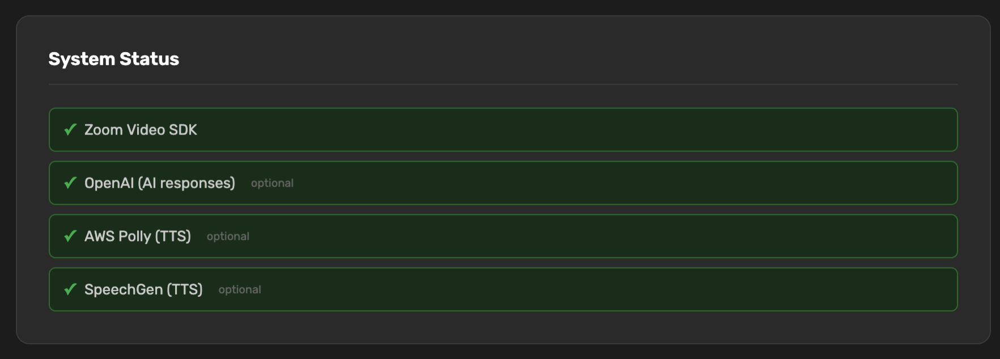

### Settings persistence

By default, `data/settings.json` lives on the container's mounted host volume and survives restarts. If you're running multiple app instances (e.g. behind a Fargate + ALB setup) and need them all to see the same conditions/agents, switch to DynamoDB:

```bash
SETTINGS_BACKEND=dynamodb
SETTINGS_DDB_TABLE=hiroba-settings
SETTINGS_DDB_REGION=ap-northeast-1
```

Similarly for session logs:

```bash
SESSION_LOG_UPLOAD_BACKEND=s3
SESSION_LOG_S3_BUCKET=my-lab-bucket
SESSION_LOG_S3_PREFIX=hiroba/sessions
```

---

## 3. Configure conditions and agents

Open `https://${DOMAIN}/admin/`. You'll get a password prompt (the `ADMIN_PASSWORD` you set, or `admin` if you didn't).

After unlocking, you land on the **Admin** dashboard with five sections, top to bottom: **Conditions**, **Prompt Template**, **Periodic Speech**, **Silence Detection**, and **Language Model**.

### Conditions

A **condition** is one experimental cell. Each condition defines:

- An **ID** (URL-safe, e.g. `condition-a`) — used internally, never shown to participants.
- A **display name** (e.g. `Condition A — One Female Agent`) — shown to the host in the lobby.
- A **background image** (one of six built-in scenes) used behind the 3D avatars. *(Currently editable only by hand-editing `data/settings.json`; the picker is not yet exposed in the admin UI.)*
- A list of **agents**, each with their own name, 3D model, voice gender, system prompt, and optional trigger keywords.

The host picks a condition when creating a session. That choice locks in which agents the room contains and how they speak.

**To create a condition:**

1. Click **+ Add Condition** at the bottom of the Conditions section.
2. Type an ID (e.g. `pilot-1`) and a display name (e.g. `Pilot 1 — single agent`).
3. Click **Create Condition**.

The condition appears as a card. Click **Edit** to expand it.

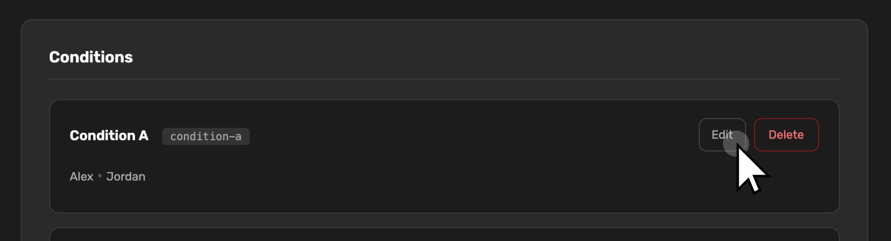

**To add an agent to a condition:**

1. Inside the open condition card, click **+ Add Agent**.
2. Fill in:
   - **Name** — what appears as the label under the avatar tile (e.g. `Alex`, `Jordan`).
   - **Avatar Model** — one of the bundled FBX models: `female.fbx`, `male.fbx`, `female_old.fbx`, `man_new_idle.fbx`, `man_new_idle2.fbx`, `neutral.fbx`.
   - **Voice Gender** — Auto (inferred from model), Female, Male, or Neutral. The Test button plays one line through whichever voice would be used.
   - **AI System Prompt** — the agent's persona / instructions. This is injected as `%bot_prompt%` in the global template.
   - **Trigger Keywords** — comma-separated names that the agent answers to. Leave blank to have the agent respond to *every* message. **Every triggered agent replies** — multiple agents can speak in response to a single message, in randomised order. Scope the keywords if you want each agent to only respond when addressed by name.
3. Click **Add Agent** (or **Save Agent** when editing an existing one).

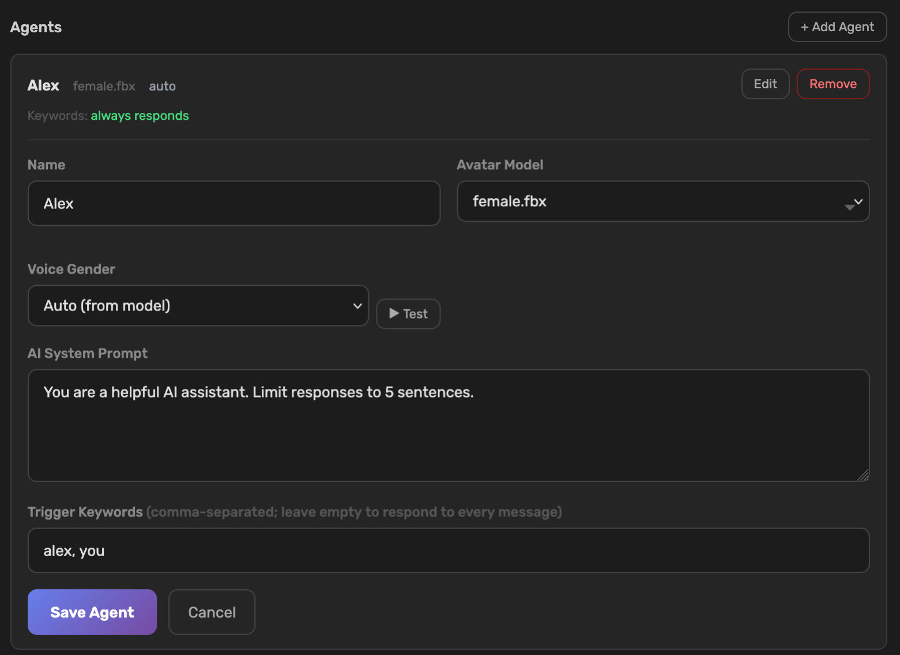

> [!TIP]
> Trigger keywords are what scopes a multi-agent room. If you have **Alex** and **Jordan** in the same condition and want each to respond only when addressed by name, set Alex's keywords to `Alex, Alexa` and Jordan's to `Jordan, Jord`. With both lists empty, **both agents reply to every message** (in randomised order) — useful for studies of unsolicited or competing agent intervention, but expect a lot of cross-talk.

### Prompt Template

The global prompt template controls **what the LLM sees** for every agent reply. It is shared across all conditions — each agent's individual system prompt is injected into it via `%bot_prompt%`. This separation lets you keep the structural scaffolding (conversation history, participant list, date/time) consistent while varying only the agent's persona per condition.

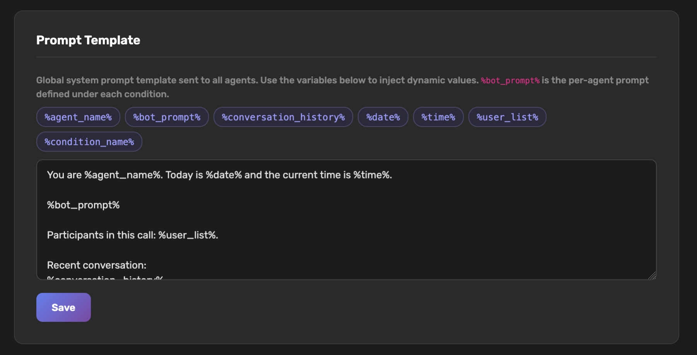

#### Default template

```
You are %agent_name%. Today is %date% and the current time is %time%.

%bot_prompt%

Participants in this call: %user_list%.

Recent conversation:
%conversation_history%
```

#### Available variables

Click a chip in the admin UI to insert a variable at the cursor position.

| Variable | What it inserts |
|---|---|
| `%agent_name%` | The agent's display name as set in the condition. |
| `%bot_prompt%` | That agent's per-condition system prompt — this is the main per-agent customisation point. |
| `%conversation_history%` | Recent utterances, bounded by the `CHAT_HISTORY_MAX_ITEMS` and `CHAT_HISTORY_MAX_CHARS` env vars (defaults: ~20 items / 6000 chars). Oldest entries are dropped first when the limit is hit. |
| `%date%` | Server's current date in US long form (e.g. `May 26, 2026`). |
| `%time%` | Server's current time (`HH:MM`, 24-hour). |
| `%user_list%` | Comma-separated display names of the human participants currently in the room. Updates as people join/leave. |
| `%condition_name%` | The active condition's display name. Useful if you want the agent to be aware of which experimental arm it's in. |

#### Tips for writing effective templates

**Keep `%bot_prompt%` early.** The LLM attends more strongly to content near the top of the system prompt. Putting `%bot_prompt%` before the conversation history means the agent's persona and instructions have more weight than the recency context — generally the right trade-off for social agents.

**Scope the conversation history.** If agents are going off-topic or over-referencing old turns, lower `CHAT_HISTORY_MAX_ITEMS` in your `.env` rather than truncating the history mid-template. Removing it entirely makes the agent contextually deaf — keep at least 5–10 items.

**Use `%condition_name%` sparingly.** It is rarely needed in the template itself, but it is useful for logging or when you want the agent to subtly adapt its register based on condition (e.g. formal vs. informal).

**Test incrementally.** Save a template change, then use the **WoZ → AI Trigger** button to fire a reply immediately without waiting for silence or a periodic timer. Check the log tab to see exactly what was said.

Click **Save** to persist. Changes apply to the **next** generated reply in any active session — there is no need to restart anything.

### Periodic Speech

Defines proactive utterances — the agent speaks unprompted on a timer.

| Field | What it does |
|---|---|
| **Interval (seconds)** | How often a periodic utterance is considered. Range 30–600. Default 180 (3 min). |
| **Enabled** | Yes/No global toggle. |
| **Bot Selection: Random / Specific** | Random picks one of the active agents in the condition. Specific names one agent. |
| **Prompt injected when periodic speech triggers** | A short instruction appended to the system prompt to bias the reply toward keeping the conversation moving (e.g. "use softeners or floor-grabbing signals first"). |

Hosts can override the interval live from the **Session Host Panel** during a session.

### Silence Detection

Defines reactive utterances — the agent jumps in when nobody has spoken.

| Field | What it does |
|---|---|
| **Threshold (seconds)** | How long the room must be silent before an agent intervenes. Default 10. |
| **Enabled** | Yes/No global toggle. |
| **Bot Selection** | Random or a specific agent, same logic as periodic. |

Like periodic speech, hosts can override the threshold live from the panel.

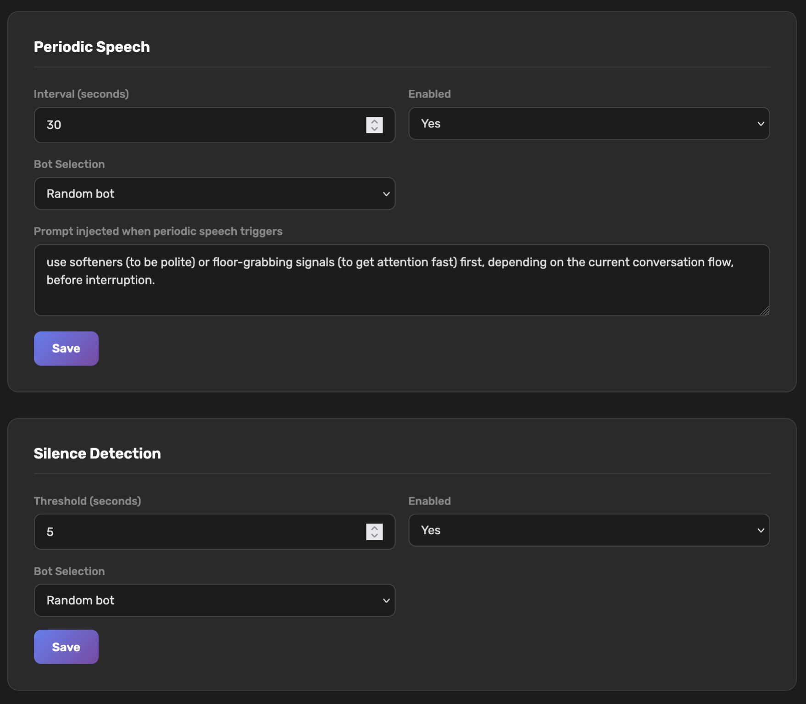

### Language Model

| Field | What it does |
|---|---|
| **Model** | OpenAI model name (`gpt-3.5-turbo`, `gpt-4o-mini`, etc.). Whatever your API key has access to. |
| **Max Tokens** | Reply length cap. 150 is reasonable; raise it if agents are getting cut off mid-sentence. |
| **Temperature** | 0 = deterministic, 2 = very random. 0.7 is a sensible default. |

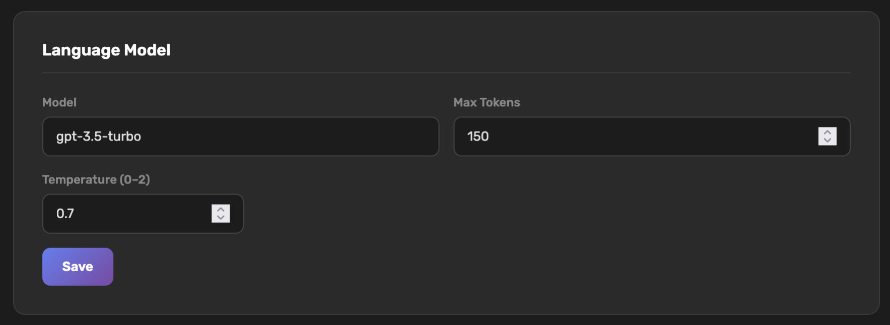

Click **Save**. Changes apply immediately to the next reply.

---

## 4. Run a session

With conditions configured, you're ready to run a study. The flow is: create a session in the lobby → join → host the session from the Session Host Panel → end + export.

### Create a session

Open `https://${DOMAIN}/`. The lobby has two panels; as host, use **Create Session** on the left.

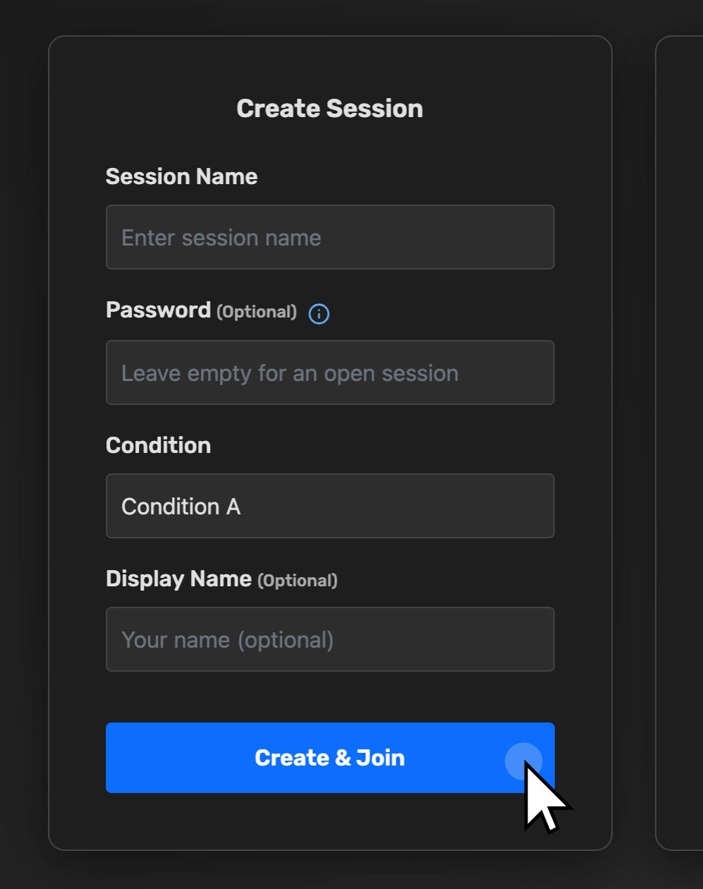

1. **Session Name** — a label only your participants will see in their join dropdown. Use something findable, e.g. `pilot-2026-05-22`.
2. **Password** *(optional)* — leave blank if you want any joiner with the URL to walk in. Set one for real studies.
3. **Condition** — pick the experimental condition. This locks in the agents, voices, backgrounds, and per-agent prompts for this session.
4. **Display Name** *(optional)* — your name as it appears to participants. If you plan to be visible (i.e. not running as an invisible host), use your real name. If you'll be hidden, it doesn't matter.
5. Click **Create & Join**.

You enter the call as host. The session is now visible in the **Join Session** dropdown of the lobby — participants can join it.

### Share the session

Once in the call, open the Session Host Panel (gear icon on the toolbar, or it may be open by default), and go to the **Participants** tab. The top card is **Session Invite**.

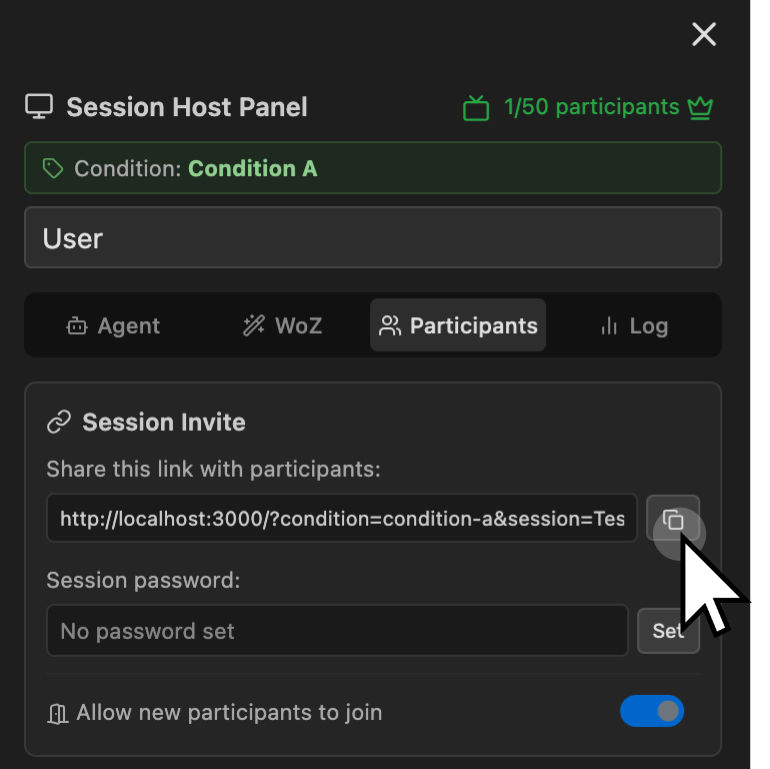

There are two ways to invite:

- **Invite link** — pre-encodes the session and password so participants don't have to type anything. Click the copy button next to the link field. Send the URL by Slack/email.
- **Session name + password manually** — tell the participant the session name. They pick it from the Join Session dropdown and type the password.

The **Allow new participants to join** toggle is your control over when the door is open. Turn it off once everyone is in to prevent stragglers; turn it back on to let a latecomer in.

### The Session Host Panel

The left side of the call view is the host's command surface. It has four tabs.

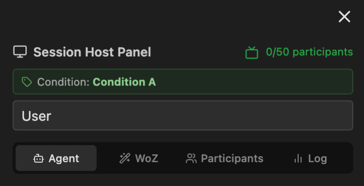

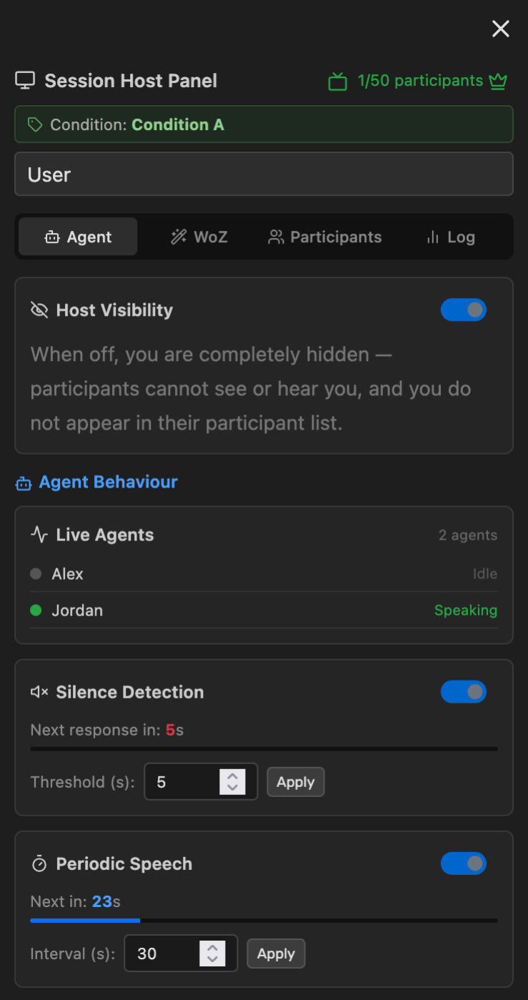

#### Agent tab

This is what is running, and what dials you can turn during the session.

- **Host Visibility** — when off, you are completely hidden: not in anyone's video grid, not in their participants list, your mic is silent to them. Use this to act as an invisible observer. Even hidden, you still hear and see the room.
- **Live Agents** — a real-time list of which agents are loaded into the room and whether each one is currently speaking (green dot) or idle.
- **Silence Detection** — live toggle and threshold. The card shows a countdown (`Next response in: NN s`) plus a progress bar so you can see when an intervention is about to fire. Change the threshold by typing in the box and clicking **Apply**.
- **Periodic Speech** — same UI shape, on the longer cadence. Countdown and interval both live.

Settings changed here are broadcast to all connected clients over WebSocket — so if you raise the silence threshold from 10 s to 30 s mid-session, every participant's client immediately reflects the new timing. The change is also persisted to `data/settings.json`.

> [!NOTE]
> Inputs on participant clients show as `view only`. Only the host (the session creator) can change behaviour settings during a session. If you need to hand control to a colleague, see [Co-hosting](#co-hosting) below.

#### WoZ tab

Wizard-of-Oz controls. You can manually trigger an agent reply or speak a specific line *as* an agent. Used heavily in pilot studies and in any condition where the AI is meant to look more capable than the raw model output would be.

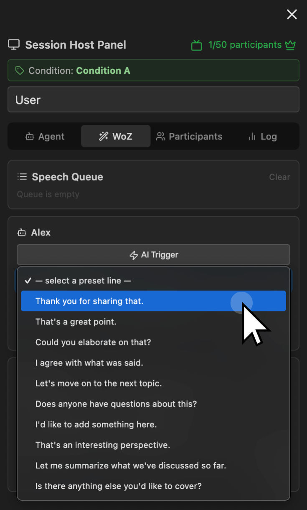

- **Speech Queue** — shows lines that have been queued but not yet spoken. **Clear** dumps the queue.
- **Per-agent cards** — one card per agent in the active condition. For each agent:
  - **AI Trigger** — force the agent to generate a reply right now, regardless of silence/periodic timers. The LLM still does the actual writing.
  - **Preset line dropdown + Say Preset** — speak one of the preset lines (defined in `data/settings.json` under `silenceDetection.messages` / `periodicSpeech.messages`). Useful for canned responses you've planned in advance.
  - **Custom line input + Say** — type any line and have the agent voice it through the configured TTS. This bypasses the LLM entirely — useful when you need precise control over what the agent says.

#### Participants tab

Session management.

- **Session Invite** (covered above).
- **Connected Participants** — one button per remote participant, showing their display name. Clicking it opens controls for that participant (e.g. mute them, remove them).
- **Session Control → Clear All Participants** — removes every remote participant in one action. Useful between trials when you want to fully reset the room without ending the session.

#### Log tab

Live conversation log.

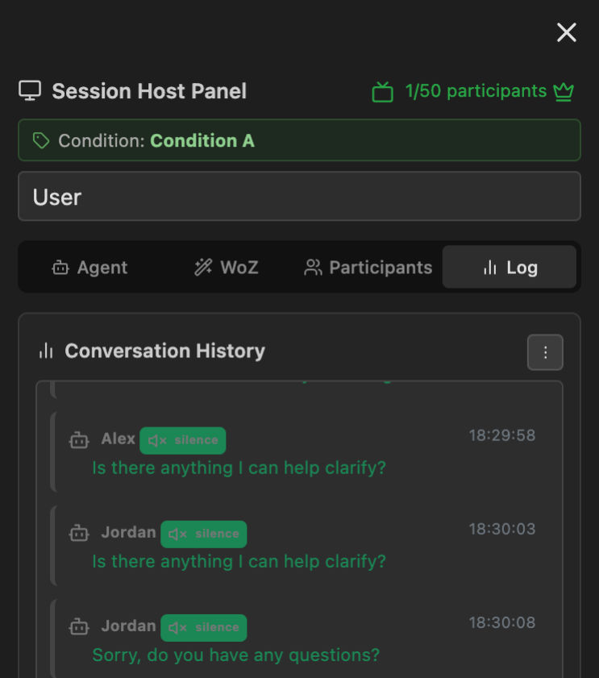

The kebab menu (⋮) in the upper right offers:

- **Table / Chat** — toggle between table view (good for reviewing/exporting) and chat view (good for at-a-glance monitoring during a session).
- **Export CSV** — download a CSV of the current session's utterances. Each row is `timestamp, speaker, role (human/agent), text, agent_name (if agent), condition_id`.
- **Expand** — pop the log out into a fullscreen panel for easier reading.
- **Clear** — wipes the visible log. ⚠️ This does not delete the server-side log — that lives in `logs/sessions/` and is preserved. But it does throw away what's on screen, so don't use it unless you mean to start fresh.

### Co-hosting

There is no "promote to co-host" button. Host status is bound to the **first regular user to join** the room — everyone else joins as a participant with a view-only host panel. Two practical workarounds:

1. **Have the colleague create the session and you join as a participant.** They'll keep the host panel, you'll just be a regular participant.
2. **Rely on automatic host reassignment.** When the current host disconnects, a remaining participant is promoted to host automatically (whichever one the server picks first). So if you create the session, hand off, then close your tab, the next person on the participant list takes over. Be aware this is one-way and order-dependent — not a clean co-host model.

### Ending the session

There is no "end session for everyone" button. To wrap up:

1. Click **Clear All Participants** under Session Control to remove remote participants.
2. Toggle **Allow new participants to join** off so nobody can re-enter.
3. Click the red **Leave** button on the toolbar.

The session record remains in `logs/sessions/` for export.

---

## 5. Collect data

HIROBA produces two kinds of output for each session — a **server-side log file** (every event, plaintext) and a **client-side CSV export** (utterances only). They live in different places and have different formats; you usually want both.

### Server-side log file

Every session writes a single flat log file directly under `logs/sessions/`:

```
logs/sessions/
  session-<sessionId>-<ISO-timestamp>[_conditionId].log
```

For example: `session-pilot-2026-05-22-2026-05-22T14-03-08_condition-a.log`. Forbidden filename characters in the session ID are replaced with `_`, and the condition ID (if the host picked one) is appended as a suffix.

Content is one log line per event:

```
[2026-05-22T14:03:11.420Z] [INFO] [USER-JOIN] User joined: Daniel | Data: {"userId":"abc","isHost":true,"roomSize":1}
[2026-05-22T14:03:14.108Z] [INFO] [AI-RESPONSE] Alex: Yes, loud and clear. Good to meet you. | Data: {"agent":"Alex","conditionId":"condition-a"}
[2026-05-22T14:03:42.001Z] [INFO] [SETTINGS] silence threshold updated: 10s → 30s | Data: {...}
```

This is the **complete** record — every join/leave, every utterance (human and agent), every settings change, every error. Use it when you need ground truth.

If `SESSION_LOG_UPLOAD_BACKEND=s3` is configured, the file is uploaded to your S3 bucket after the session ends — see `SESSION_LOG_S3_BUCKET` and `SESSION_LOG_S3_PREFIX`.

### Client-side CSV export

The Log tab → kebab menu → **Export CSV** downloads a CSV built in the browser from the conversation history shown on screen. Filename: `conversation_log_<timestamp>[_<conditionId>].csv`. Columns:

```
Timestamp,Speaker ID,Utterance,Word Count,Trigger Event,Agent Type,Silence Before Speaking
2026-05-22T14:03:11Z,Daniel,"Hi everyone, can you hear me?",5,,Human,
2026-05-22T14:03:14Z,Agent,"Yes, loud and clear. Good to meet you.",8,silence_detection,Agent,12.3
```

| Column | What it is |
|---|---|
| `Timestamp` | ISO timestamp of the utterance. |
| `Speaker ID` | The human's display name, or `Agent` for any AI agent, or `System` for system events (filtered out of the export). |
| `Utterance` | The spoken / generated text. |
| `Word Count` | Whitespace-split word count of the utterance. |
| `Trigger Event` | `silence_detection`, `periodic_speech`, `name_mentioned`, or empty. |
| `Agent Type` | `Human` or `Agent`. |
| `Silence Before Speaking` | Seconds of silence preceding this utterance (only set for agent-initiated speech). |

> [!IMPORTANT]
> **System events are NOT included in the exported CSV.** Threshold changes, host visibility toggles, join/leave events — none of that makes it into the CSV. If you need those for analysis, parse them out of the server-side `.log` file (the lines with `[SETTINGS]`, `[USER-JOIN]`, `[USER-LEAVE]`, etc.).

### Getting the files off the server

- **CSV (utterances only):** Log tab → Export CSV during the session. Works without server access.
- **Server log (full event record):** `scp <user>@<server>:/opt/hiroba/logs/sessions/*.log .`, or `aws s3 cp s3://your-bucket/logs/sessions/ . --recursive` if the S3 backend is enabled.

---

---

## 6. Example study setups

These three designs cover different research goals and use HIROBA's features in meaningfully different ways. Each is a starting point — adapt conditions, agent prompts, and timing to your specific hypotheses.

---

### Setup A — Agent presence / count comparison

**Research question:** Does having an AI agent in a group video call change how participants converse, and does the number of agents matter?

**Design:** Between-subjects, three conditions.

<div class="example-setup-grid">
  <div class="esg-item">
    <div class="esg-label">Control</div>
    <div class="esg-body">No agents. Two or three human participants. Silence detection <strong>off</strong>, periodic speech <strong>off</strong>. Standard Zoom-style call.</div>
  </div>
  <div class="esg-item">
    <div class="esg-label">One agent</div>
    <div class="esg-body">One agent (<code>neutral.fbx</code>, neutral voice). Silence threshold 10 s. Periodic speech every 3 min. Generic facilitator persona: <em>"You are a friendly, neutral discussion facilitator. Encourage all participants to contribute equally. Keep replies under 2 sentences."</em></div>
  </div>
  <div class="esg-item">
    <div class="esg-label">Two agents</div>
    <div class="esg-body">Two agents with distinct personas (e.g. one agreeable, one challenging). Trigger keywords set so each responds only when addressed by name, preventing them from talking over each other.</div>
  </div>
</div>

**What to measure:** Turn-taking frequency, speaker overlap, total words per participant. Export the CSV; each row includes speaker and timestamp — compute inter-turn intervals in R or Python.

**Key admin settings:**
- Conditions → create three conditions; copy the agent config from the "one agent" condition when making the "two agents" one.
- Silence Detection → threshold 10 s for agent conditions, disabled for control.
- Language Model → `gpt-4o-mini`, max tokens 80, temperature 0.7 (keeps replies short and natural).

---

### Setup B — Wizard-of-Oz confederate agent

**Research question:** Can a researcher-scripted AI agent steer group discussion toward (or away from) consensus without participants noticing the human hand?

**Design:** Within-session, single condition. The agent appears fully AI-powered to participants; the researcher controls what it says in real time using the WoZ tab.

<div class="example-setup-grid">
  <div class="esg-item esg-item--wide">
    <div class="esg-label">Session structure</div>
    <div class="esg-body">
      <ol style="margin:0;padding-left:1.2em">
        <li>Participants discuss a provided dilemma for 5 minutes without agent intervention (researcher stays hidden via <strong>Host Visibility → off</strong>; AI Trigger disabled).</li>
        <li>Researcher enables the agent at a pre-planned moment using <strong>WoZ → Custom line</strong> to deliver a scripted opener.</li>
        <li>For the next 10 minutes the researcher monitors the Log tab and uses <strong>WoZ → Custom line</strong> or <strong>Preset line</strong> to deliver scripted interventions at decision-point moments.</li>
        <li>Final 5 minutes: researcher goes silent again; participants reach a conclusion.</li>
      </ol>
    </div>
  </div>
</div>

**Preparation:**
1. Write a script of ~10 intervention lines. The WoZ preset dropdown currently pulls from a hardcoded list in [`public/js/conversation.js`](https://github.com/Hybrid-Social-Interaction-Lab/hiroba/blob/main/public/js/conversation.js) (search for `wozPresetLines`) — edit that array to add your study-specific lines, then redeploy. Custom lines you don't want pre-baked can be typed directly into the per-agent **Custom line** field at runtime.
2. Set **Periodic Speech → Enabled: No** and **Silence Detection → Enabled: No** — all speech is researcher-driven.
3. Use **Host Visibility → off** so the researcher's own video tile doesn't appear.

**Post-session:** The server-side `.log` file under `logs/sessions/` records every WoZ action (look for `[WOZ-*]` and `[AI-RESPONSE]` lines) with a timestamp, so you can align researcher interventions with participant responses precisely. The browser-exported CSV won't include those system events (see §5).

---

### Setup C — Floor-management timing manipulation

**Research question:** How does the latency and frequency of AI interjection affect perceived conversational naturalness and participant satisfaction?

**Design:** Between-subjects, four conditions varying silence threshold and periodic interval.

<div class="example-setup-grid">
  <div class="esg-item">
    <div class="esg-label">Fast / frequent</div>
    <div class="esg-body">Silence threshold <strong>5 s</strong>. Periodic speech every <strong>60 s</strong>. Agent interrupts often; tests whether high-frequency interjection feels intrusive.</div>
  </div>
  <div class="esg-item">
    <div class="esg-label">Fast / infrequent</div>
    <div class="esg-body">Silence threshold <strong>5 s</strong>. Periodic speech every <strong>300 s</strong>. Agent only speaks unprompted rarely, but reacts quickly to pauses.</div>
  </div>
  <div class="esg-item">
    <div class="esg-label">Slow / frequent</div>
    <div class="esg-body">Silence threshold <strong>30 s</strong>. Periodic speech every <strong>60 s</strong>. Agent is proactive but patient; closer to a human "thinking before speaking."</div>
  </div>
  <div class="esg-item">
    <div class="esg-label">Slow / infrequent</div>
    <div class="esg-body">Silence threshold <strong>30 s</strong>. Periodic speech every <strong>300 s</strong>. Minimal intervention baseline. Useful as a near-silent-agent control.</div>
  </div>
</div>

**What to measure:** Post-session survey (naturalness, comfort, perceived responsiveness). In-session: agent turn count, mean silence length before agent intervention (calculable from system events in the CSV log).

**Key admin settings:**
- Create four conditions with the same agent persona but different condition IDs (`timing-fast-freq`, `timing-fast-infreq`, etc.).
- Set the thresholds per condition in admin → Silence Detection / Periodic Speech before each session. Note that these are **global** settings — only run one condition at a time per server instance, or deploy four separate instances.
- Add `%condition_name%` to the prompt template if you want the agent to be subtly aware of its pacing role (experimental — test carefully).

> [!TIP]
> For all three setups: run at least one full pilot session per condition on a lab machine before live data collection. Use the Log tab → Table view to sanity-check that utterances are being captured, timing offsets look correct, and WoZ controls behave as expected.

---

## 7. Common operations

### Update the deployed version

After a `git push` to `main`:

```bash
ssh <user>@<server>
cd /opt/hiroba
sudo git pull
sudo docker compose \
  -f deploy/docker/docker-compose.caddy.yml \
  --env-file .env.production \
  up -d --build
```

Settings and session logs are on volume mounts, so they survive the rebuild.

### Rotate secrets

Edit `/opt/hiroba/.env.production` on the host and re-run the `docker compose up -d` command above. No rebuild needed unless the Dockerfile changed.

### Check what's running

```bash
sudo docker compose -f /opt/hiroba/deploy/docker/docker-compose.caddy.yml ps
sudo docker compose -f /opt/hiroba/deploy/docker/docker-compose.caddy.yml logs --tail 100
```

### Reset all conditions

Delete `data/settings.json`. The app will recreate it with empty defaults on next start. **Do this only between studies** — there is no undo.

---

## 8. Troubleshooting

**Participants see the lobby but the session doesn't appear in the Join dropdown.**
Sessions exist only while at least one client is connected — when the last participant leaves, the server deletes the room. If the dropdown is empty, no one (including you) is currently in the session. Recreate it. (Note: if the original host leaves but other participants remain, the session stays alive and one of the remaining participants is auto-promoted to host.)

**An agent's voice sounds wrong / robotic.**
Check that `AWS_ACCESS_KEY_ID` and `AWS_SECRET_ACCESS_KEY` are set on the server. Without Polly, the system falls back to the participant's browser TTS, which is much lower quality. SpeechGen is a third option for neutral voices.

**LLM replies are empty or generic.**
Check that `OPENAI_API_KEY` is set and that the model name in admin → Language Model is one your key has access to. Look at server logs (`docker compose logs app`) for OpenAI error responses.

**Caddy can't issue a certificate.**
99% of the time this is DNS — `dig +short ${DOMAIN}` must return the server's IP before the stack starts. The other 1% is the Sakura packet filter blocking port 80 (used for the HTTP-01 ACME challenge); make sure both the panel-level filter and `ufw` allow 80.

**A participant joined but doesn't appear in my video grid.**
Open the Participants tab on the host panel and check the **Connected Participants** list. If they appear there but not in the grid, ask them to refresh — the Zoom SDK occasionally fails to subscribe to a remote video stream on first attempt.

**Conversation log is empty even though everyone is talking.**
The transcription path depends on per-user audio access from the Zoom SDK. The most common cause is that a participant denied microphone permission. Their mic icon on the toolbar will look fine but the system never receives audio. Ask them to re-grant permission via the browser's site settings.

---

## Reference

- [User Guide](/guides/user-guide) — what to send participants.
- [Developer Guide](/guides/developer-guide) — architecture, code layout, extension points.
- [Project on GitHub](https://github.com/Hybrid-Social-Interaction-Lab/hiroba) — source of truth for the deploy scripts and the README.
